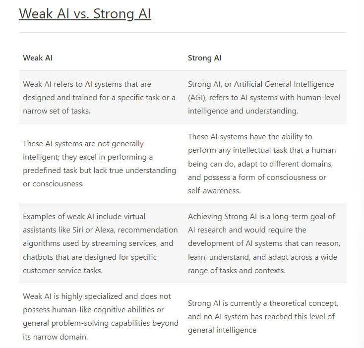

Artificial Intelligence is an exciting scientific discipline that studies how we can make computers exhibit intelligent behavior, e.g. do those things that human beings are good at doing.  

Originally, computers were invented by Charles Babbage to operate on numbers following a well-defined procedure - an algorithm. Modern computers, even though significantly more advanced than the original model proposed in the 19th century, still follow the same idea of controlled computations. Thus it is possible to program a computer to do something if we know the exact sequence of steps that we need to do in order to achieve the goal.

There are some tasks, however, that we do not explicitly know how to solve. Consider determining the age of a person from his/her photograph. We somehow learn to do it, because we have seen many examples of people of different age, but we cannot explicitly explain how we do it, nor can we program the computer to do it. This is exactly the kind of task that are of interest to Artificial Intelligence (AI for short).

### The Definition of Intelligence and the Turing Test
One of the problems when dealing with the term Intelligence is that there is no clear definition of this term. One can argue that intelligence is connected to abstract thinking, or to self-awareness, but we cannot properly define it. 

To see the ambiguity of a term intelligence, try answering a question: "Is a cat intelligent?". Different people tend to give different answers to this question, as there is no universally accepted test to prove the assertion is true or not. And if you think there is - try running your cat through an IQ test...  

When speaking about AGI we need to have some way to tell if we have created a truly intelligent system. Alan Turing proposed a way called a Turing Test, which also acts like a definition of intelligence. The test compares a given system to something inherently intelligent - a real human being, and because any automatic comparison can be bypassed by a computer program, we use a human interrogator. So, if a human being is unable to distinguish between a real person and a computer system in text-based dialogue - the system is considered intelligent. 

### Different Approaches to AI
- **Top-down Approach (Symbolic Reasoning)**	 
  A top-down approach models the way a person reasons to solve a problem. It involves extracting knowledge from a human being, and representing it in a computer-readable form. We also need to develop a way to model reasoning inside a computer.
- **Bottom-up Approach (Neural Networks)**  
  A bottom-up approach models the structure of a human brain, consisting of a huge number of simple units called neurons. Each neuron acts like a weighted average of its inputs, and we can train a network of neurons to solve useful problems by providing training data.

### A Brief History of AI  
Artificial Intelligence was started as a field in the middle of the twentieth century. Initially, symbolic reasoning was a prevalent approach, and it led to a number of important successes, such as expert systems – computer programs that were able to act as an expert in some limited problem domains. However, it soon became clear that such approach does not scale well. Extracting the knowledge from an expert, representing it in a computer, and keeping that knowledgebase accurate turns out to be a very complex task, and too expensive to be practical in many cases. This led to so-called AI Winter in the 1970s.

As time passed, computing resources became cheaper, and more data has become available, so neural network approaches started demonstrating great performance in competing with human beings in many areas, such as computer vision or speech understanding. In the last decade, the term Artificial Intelligence has been mostly used as a synonym for Neural Networks, because most of the AI successes that we hear about are based on them.

We can observe how the approaches changed, for example, in creating a chess playing computer program:

- Early chess programs were based on search – a program explicitly tried to estimate possible moves of an opponent for a given number of next moves, and selected an optimal move based on the optimal position that can be achieved in a few moves. It led to the development of the so-called alpha-beta pruning search algorithm.
- Search strategies work well toward the end of the game, where the search space is limited by a small number of possible moves. However, at the beginning of the game, the search space is huge, and the algorithm can be improved by learning from existing matches between human players. Subsequent experiments employed so-called case-based reasoning, where the program looked for cases in the knowledge base very similar to the current position in the game.
- Modern programs that win over human players are based on neural networks and reinforcement learning, where the programs learn to play solely by playing a long time against themselves and learning from their own mistakes – much like human beings do when learning to play chess. However, a computer program can play many more games in much less time, and thus can learn much faster.

