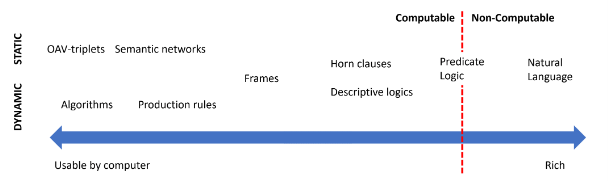

### Knowledge Representation and Expert Systems

#### Knowledge Representation

One of the important concepts in Symbolic AI is knowledge. It is important to differentiate knowledge from information or data. For example, one can say that books contain knowledge, because one can study books and become an expert. However, what books contain is actually called data, and by reading books and integrating this data into our world model we convert this data to knowledge.

*Knowledge is something which is contained in our head and represents our understanding of the world. It is obtained by an active learning process, which integrates pieces of information that we receive into our active model of the world.*

- *Data* is something represented in physical media, such as written text or spoken words. Data exists independently of human beings and can be passed between people.

- *Information* is how we interpret data in our head. For example, when we hear the word computer, we have some understanding of what it is.

- *Knowledge* is information being integrated into our world model. For example, once we learn what a computer is, we start having some ideas about how it works, how much it costs, and what it can be used for. This network of interrelated concepts forms our knowledge.

- *Wisdom* is yet one more level of our understanding of the world, and it represents meta-knowledge, eg. some notion on how and when the knowledge should be used.

Thus, the problem of knowledge representation is to find some effective way to represent knowledge inside a computer in the form of data, to make it automatically usable. This can be seen as a spectrum:

### Classifying Computer Knowledge Representations

- *Network representations* are based on the fact that we have a network of interrelated concepts inside our head. We can try to reproduce the same networks as a graph inside a computer - a so-called semantic network.  
Object-Attribute-Value triplets or attribute-value pairs. Since a graph can be represented inside a computer as a list of nodes and edges, we can represent a semantic network by a list of triplets, containing objects, attributes, and values. For example, we build the following triplets about programming languages: 

- *Hierarchical representations* emphasize the fact that we often create a hierarchy of objects inside our head. For example, we know that canary is a bird, and all birds have wings. We also have some idea about what colour a canary usually is, and what is their flight speed. 
Frame representation is based on representing each object or class of objects as a frame which contains slots. Slots have possible default values, value restrictions, or stored procedures that can be called to obtain the value of a slot. All frames form a hierarchy similar to an object hierarchy in object-oriented programming languages.

- *Procedural representations* are based on representing knowledge by a list of actions that can be executed when a certain condition occurs. 
Production rules are if-then statements that allow us to draw conclusions. For example, a doctor can have a rule saying that IF a patient has high fever OR high level of C-reactive protein in blood test THEN he has an inflammation. Once we encounter one of the conditions, we can make a conclusion about inflammation, and then use it in further reasoning.
Algorithms can be considered another form of procedural representation, although they are almost never used directly in knowledge-based systems.

- *Logic* was originally proposed by Aristotle as a way to represent universal human knowledge.
  Predicate Logic as a mathematical theory is too rich to be computable, therefore some subset of it is normally used, such as Horn clauses used in Prolog.
Descriptive Logic is a family of logical systems used to represent and reason about hierarchies of objects distributed knowledge representations such as semantic web.

